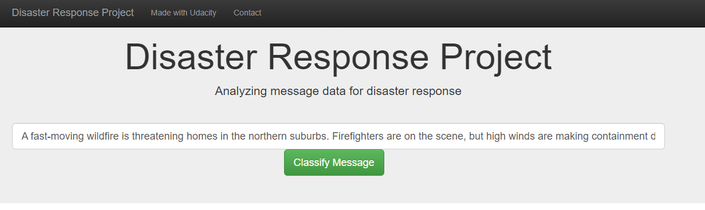
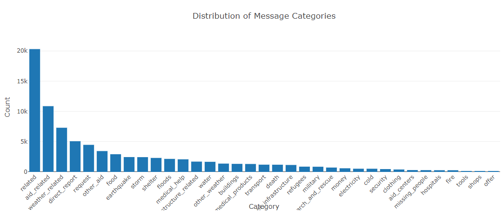
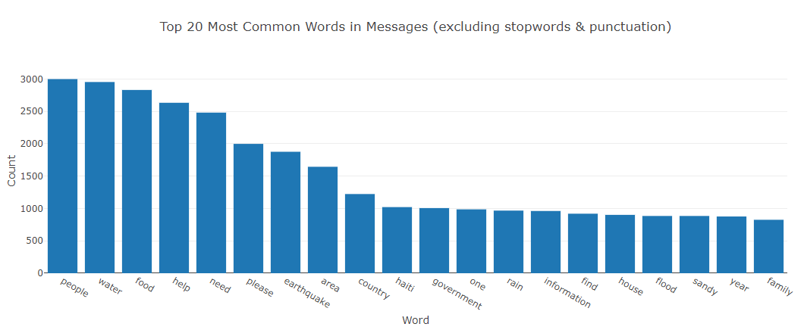
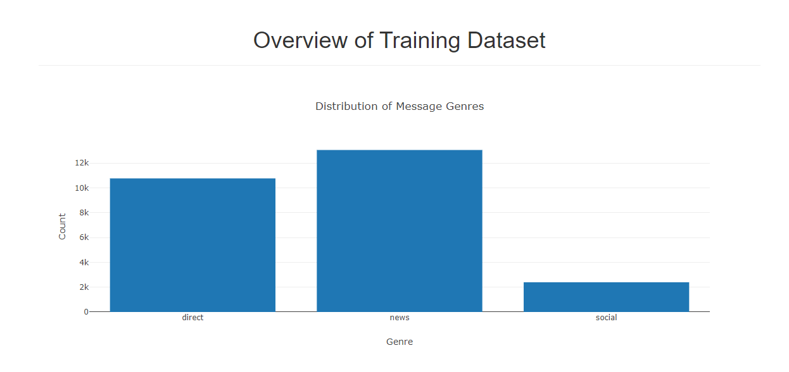

# Disaster Response Pipeline

## Project Overview
The Disaster Response Pipeline is an end-to-end machine learning solution designed to process disaster-related messages and classify them into multiple actionable categories, such as requests for medical help, water, and shelter. By providing real-time classification, this tool aids emergency response teams in prioritizing and allocating resources more effectively during crises. The project includes data extraction, transformation, and loading (ETL), model development and evaluation, and deployment as an interactive web application.

## File Structure

- **app/**
  - **templates/**: HTML templates for the web application interface.
  - **run.py**: Script to launch the Flask web application.

- **data/**
  - **disaster_messages.csv**: Dataset containing disaster-related messages.
  - **disaster_categories.csv**: Dataset categorizing the messages.
  - **DisasterResponse.db**: SQLite database storing the cleaned dataset.
  - **process_data.py**: ETL script to clean and store data in the database.

- **models/**
  - **train_classifier.py**: Script to build, train, and save the machine learning model.
  - **classifier.pkl**: Serialized trained model for deployment.

- **README.md**: Documentation outlining project setup, usage, and methodology.

- **requirements.txt**: List of dependencies required to run the project.

# Libraries Used

- **Pandas**: Data manipulation and analysis.
- **Numpy**: Numerical computing.
- **Scikit-learn**: Machine learning and model building.
- **NLTK**: Natural language processing.
- **Flask**: Web application development.
- **SQLAlchemy**: Database management.

## Installation
1. Clone the repository:
    ```bash
   git clone <repository_url>
   cd DisasterResponsePipeline
    ```
2. Install Dependencies: 
    ```bash
   pip install -r requirements.txt
    ```
3. Download necessary NLTK data:
   ```python
   python -c "import nltk; nltk.download(['punkt', 'wordnet', 'stopwords'])"
   ```
# Running the ETL Pipeline

The ETL pipeline is responsible for loading data from CSV files, cleaning and processing the data, and storing it in a SQLite database.

1. Run the ETL pipeline:
    ```bash
    python data/process_data.py data/disaster_messages.csv data/disaster_categories.csv data/DisasterResponse.db
    ```
    This script:
   - Loads and merges the messages and categories datasets.
   - Cleans the data by splitting categories, converting values to binary, and removing duplicates.
   - Saves the cleaned data in `DisasterResponse.db` for use in model training.

### Data Cleaning Process

The data cleaning process includes:

- **Splitting Categories**: The categorical values are separated into individual columns.
- **Binary Conversion**: Category values are converted to binary (0 or 1) for classification purposes.
- **Duplicate Removal**: Duplicate records are identified and removed to ensure data quality.
    ```python
    # Example of category splitting and conversion to binary
    # categories = df['categories'].str.split(';', expand=True)
    row = categories.iloc[0]
    category_colnames = row.apply(lambda x: x.split('-')[0]).tolist()
    categories.columns = category_colnames
    for column in categories:
        categories[column] = categories[column].apply(lambda x: x.split('-')[1]).astype(int)
    ```
# Running the Machine Learning Pipeline

The machine learning pipeline loads the cleaned data, trains a multi-output classification model, and saves the model for deployment.

1. Run the machine learning pipeline:
    ```bash
    python models/train_classifier.py data/DisasterResponse.db models/classifier.pkl
    ```

This script:

- Loads the cleaned data from the SQLite database.
- Processes the text data using NLP techniques (e.g., tokenization, lemmatization).
- Trains a multi-output SVM classifier with TF-IDF features.
- Saves the trained model to `classifier.pkl` for future use.

### Model Building and Training

The model leverages a Support Vector Machine (SVM) with balanced class weights to address class imbalances in the dataset. The pipeline includes:

- **Tokenization and Lemmatization**: Using NLTK for text normalization.
- **TF-IDF Vectorization**: Transforming text data into numerical features.
- **MultiOutputClassifier**: Predicting multiple categories simultaneously.
    ```python
    svm_pipeline = Pipeline([
        ('tfidf', TfidfVectorizer(ngram_range=(1, 2), tokenizer=tokenize)),
        ('clf', MultiOutputClassifier(LinearSVC(class_weight='balanced')))
    ])
    ```

# Running the Web Application

The web application allows users to input new disaster-related messages and receive real-time classification predictions. The app also features data visualizations that provide insights into the underlying data.

1. Launch the web application:
    ```bash
    python app/run.py
    ```
    Access the application at `http://localhost:3001/`.

### Web Application Interface

Below is a snapshot of the web application's interface, showcasing the user-friendly design and real-time classification capabilities:


#### Example Classification Result:


### Visualizations

The application includes visualizations that offer valuable insights into the data and model performance:

- **Distribution of Message Categories**
    
- **Top 20 Most Common Words in Messages**
    
- **Overview of Training Dataset**
    

# Model Performance and Considerations

Model performance was evaluated using precision, recall, and F1-score metrics. Special consideration was given to categories with imbalanced data, where precision and recall trade-offs are crucial. In this context, a balanced SVM model outperformed techniques like SMOTE and ADASYN, providing the most reliable results for critical classifications.

## Key Considerations:

- **Class Imbalance**: Managed using SVM with balanced class weights.
- **Precision vs. Recall**: Emphasis on recall to minimize false negatives in critical categories.
- **Model Refinement**: GridSearchCV was used to fine-tune hyperparameters, optimizing model performance.

# Potential Partner Organizations

Based on the classified categories, potential partners for collaboration include:

- **Medical Help**: Organizations such as the Red Cross and Doctors Without Borders.
- **Basic Needs (Water, Food, Shelter)**: NGOs like World Food Program and ShelterBox.
- **Search and Rescue**: Collaborations with FEMA, local fire departments, and the military.
- **Infrastructure Repair**: Engagements with Engineers Without Borders and local authorities.

# Acknowledgments

This project was made possible by a combination of invaluable resources and community support:

- **Disaster Response Messages Dataset**: Provided by Figure Eight, offering a rich dataset for disaster response classification.
- **Python Libraries**: Including Pandas, Numpy, Scikit-learn, NLTK, and Flask, which were integral to the development of this project.
- **Udacity**: For providing a structured learning path and guidance through the Data Science Nanodegree program, which equipped me with the skills to successfully complete this project.
- **Online Communities**: Whose extensive documentation and support played a crucial role in the project's development.

   
